# NLP-Based Resume and Job Description Matching System

[](https://gitdiagram.com/keralia/nlp-resume-matching-system?utm_source=readme&utm_medium=badge)
[](https://www.python.org/)
[-green.svg)](https://huggingface.co/sentence-transformers/all-MiniLM-L6-v2)
[]()
[]()
[]()

> **TalentMatch AI** — A domain-aware contextual and lexical hybrid architecture for automated candidate-job description semantic alignment, ATS scoring, and recruiter ranking.

---

### Academic Information

- **Author**: Patel Aum Shirishkumar  
- **Enrollment No**: 12302040601004  
- **Department**: Department of Computer Engineering, A. D. Patel Institute of Technology (ADIT)  
- **Institution**: The Charutar Vidyamandal (CVM) University, Anand, Gujarat, India  
- **Course**: Natural Language Processing (Course Code: 202047809)  

---

## Architecture Diagram

```mermaid
%% Generated by https://gitdiagram.com/keralia/nlp-resume-matching-system
flowchart TD

subgraph group_web["Browser experience"]
  node_browser["TalentMatch UI<br/>[app.js]"]
  node_demo["Interactive demo<br/>[demo.py]"]
end

subgraph group_data["Matching inputs"]
  node_browser_data["Browser data<br/>[data.js]"]
  node_resumes["Resume corpus"]
  node_job_data["Job descriptions"]
  node_taxonomy["Skills taxonomy"]
end

subgraph group_matching["Matching engine"]
  node_browser_engine["Browser matcher<br/>[engine.js]"]
  node_loader["Data loader<br/>[data_loader.py]"]
  node_preprocessor["Resume preprocessing<br/>[preprocessor.py]"]
  node_skill_extractor["Skill diagnostics<br/>[skill_extractor.py]"]
  node_lexical["TF-IDF and BM25"]
  node_semantic["Semantic matching"]
  node_hybrid["Hybrid ranking<br/>[hybrid_engine.py]"]
end

subgraph group_evaluation["Python evaluation"]
  node_benchmark["Experiment runner<br/>[run_experiments.py]"]
  node_evaluator["Ranking metrics<br/>[evaluate.py]"]
end

node_recruiter(("Recruiter"))

node_recruiter -->|"selects role"| node_browser
node_browser -->|"reads data"| node_browser_data
node_browser -->|"initializes"| node_browser_engine
node_browser_engine -->|"returns diagnostics"| node_browser
node_loader -->|"loads"| node_resumes
node_loader -->|"loads"| node_job_data
node_loader -->|"loads"| node_taxonomy
node_demo -->|"loads corpus"| node_loader
node_demo -->|"ranks candidates"| node_hybrid
node_benchmark -->|"loads corpus"| node_loader
node_benchmark -->|"extracts sections"| node_preprocessor
node_benchmark -->|"computes skill scores"| node_skill_extractor
node_benchmark -->|"scores lexical"| node_lexical
node_benchmark -->|"scores semantics"| node_semantic
node_benchmark -->|"ranks candidates"| node_hybrid
node_benchmark -->|"evaluates rankings"| node_evaluator
node_hybrid -->|"extracts sections"| node_preprocessor
node_hybrid -->|"computes lexical scores"| node_lexical
node_hybrid -->|"computes semantic score"| node_semantic
node_hybrid -->|"computes skill metrics"| node_skill_extractor
node_lexical -->|"tokenizes text"| node_preprocessor
node_semantic -->|"tokenizes text"| node_preprocessor
node_browser_engine -.->|"uses skill taxonomy"| node_taxonomy

click node_browser "https://github.com/keralia/nlp-resume-matching-system/blob/main/js/app.js"
click node_browser_engine "https://github.com/keralia/nlp-resume-matching-system/blob/main/js/engine.js"
click node_browser_data "https://github.com/keralia/nlp-resume-matching-system/blob/main/js/data.js"
click node_resumes "https://github.com/keralia/nlp-resume-matching-system/blob/main/dataset/resumes_corpus.json"
click node_job_data "https://github.com/keralia/nlp-resume-matching-system/blob/main/dataset/job_descriptions.json"
click node_taxonomy "https://github.com/keralia/nlp-resume-matching-system/blob/main/dataset/skills_taxonomy.json"
click node_loader "https://github.com/keralia/nlp-resume-matching-system/blob/main/src/data_loader.py"
click node_preprocessor "https://github.com/keralia/nlp-resume-matching-system/blob/main/src/preprocessor.py"
click node_skill_extractor "https://github.com/keralia/nlp-resume-matching-system/blob/main/src/skill_extractor.py"
click node_lexical "https://github.com/keralia/nlp-resume-matching-system/blob/main/src/baseline_matcher.py"
click node_semantic "https://github.com/keralia/nlp-resume-matching-system/blob/main/src/semantic_matcher.py"
click node_hybrid "https://github.com/keralia/nlp-resume-matching-system/blob/main/src/hybrid_engine.py"
click node_demo "https://github.com/keralia/nlp-resume-matching-system/blob/main/demo.py"
click node_benchmark "https://github.com/keralia/nlp-resume-matching-system/blob/main/run_experiments.py"
click node_evaluator "https://github.com/keralia/nlp-resume-matching-system/blob/main/src/evaluate.py"

classDef toneNeutral fill:#f8fafc,stroke:#334155,stroke-width:1.5px,color:#0f172a
classDef toneBlue fill:#dbeafe,stroke:#2563eb,stroke-width:1.5px,color:#172554
classDef toneAmber fill:#fef3c7,stroke:#d97706,stroke-width:1.5px,color:#78350f
classDef toneMint fill:#dcfce7,stroke:#16a34a,stroke-width:1.5px,color:#14532d
classDef toneRose fill:#ffe4e6,stroke:#e11d48,stroke-width:1.5px,color:#881337
classDef toneIndigo fill:#e0e7ff,stroke:#4f46e5,stroke-width:1.5px,color:#312e81
classDef toneTeal fill:#ccfbf1,stroke:#0f766e,stroke-width:1.5px,color:#134e4a
class node_browser,node_demo toneBlue
class node_browser_data,node_resumes,node_job_data,node_taxonomy toneAmber
class node_browser_engine,node_loader,node_preprocessor,node_skill_extractor,node_lexical,node_semantic,node_hybrid toneMint
class node_benchmark,node_evaluator toneRose
class node_recruiter toneIndigo
```

[](https://gitdiagram.com/keralia/nlp-resume-matching-system?utm_source=readme&utm_medium=picture)



[](https://gitdiagram.com/keralia/nlp-resume-matching-system?utm_source=readme&utm_medium=badge)

---

## 1. System Architecture Overview

As illustrated in the system architecture diagram above, the project is structured into four cohesive, decoupled operational layers:

### 1. 🌐 Browser Experience Layer
- **TalentMatch UI ([`js/app.js`](js/app.js) & [`index.html`](index.html))**: Recruiter-facing single-page dashboard featuring role selection, candidate cards, live ATS health analysis, dynamic radar charts, and interactive weight calibration sliders.
- **Interactive CLI Demo ([`demo.py`](demo.py))**: Terminal-based interactive demo allowing recruiters and evaluators to test preset roles, custom job descriptions, and live adversarial keyword attack simulations.

### 2. 📂 Matching Inputs & Dataset Layer
- **Candidate Corpus ([`dataset/resumes_corpus.json`](dataset/resumes_corpus.json))**: Curated resume profiles spanning 5 technical domains, junior to staff seniority levels, and realistic edge cases (career transitions, high experience/low skills, adversarial keyword stuffing).
- **Target Job Descriptions ([`dataset/job_descriptions.json`](dataset/job_descriptions.json))**: Production job descriptions with graded relevance ground truth (0 to 3) for ranking evaluation.
- **Competency Taxonomy ([`dataset/skills_taxonomy.json`](dataset/skills_taxonomy.json))**: Structured knowledge base containing 350+ technical competencies, categorized across 7 engineering disciplines with domain aliases and acronyms.
- **Browser Data ([`js/data.js`](js/data.js))**: Serialized client-side mirror of the taxonomy, job descriptions, and benchmark candidate profiles for instantaneous zero-latency client evaluation.

### 3. ⚙️ Matching Engine Layer
- **Data Ingestion ([`src/data_loader.py`](src/data_loader.py))**: Normalizes structured/unstructured JSON schemas, serializes text blocks, and validates data integrity.
- **Resume Preprocessing ([`src/preprocessor.py`](src/preprocessor.py))**: Strips Personally Identifiable Information (PII) to ensure algorithmic fairness (GDPR/DPDP compliance), tokenizes text, and segments documents into contextual zones (*Summary, Skills, Experience, Projects, Education*).
- **Skill Diagnostics ([`src/skill_extractor.py`](src/skill_extractor.py))**: Extracts multi-word skills via greedy taxonomic phrase matching and calculates Jaccard overlap, missing skill gaps, and domain coverage.
- **Lexical Indexing ([`src/baseline_matcher.py`](src/baseline_matcher.py))**: Sub-linear TF-IDF cosine similarity and Robertson-Spärck Jones Okapi BM25 with document length normalization.
- **Contextual Semantic Matching ([`src/semantic_matcher.py`](src/semantic_matcher.py))**: Dense bi-encoder embeddings via Sentence-BERT (`all-MiniLM-L6-v2`) generating 384-dimensional contextual vectors with section weighting.
- **Tri-Partite Hybrid Engine ([`src/hybrid_engine.py`](src/hybrid_engine.py))**: Synthesizes semantic, lexical, and skill metrics into an explainable, balanced score.
- **Client-Side Matcher ([`js/engine.js`](js/engine.js))**: Pure JavaScript implementation of the hybrid scoring engine and tokenizer, enabling in-browser zero-server matching.

### 4. 📊 Python Academic Evaluation Suite
- **Experiment Runner ([`run_experiments.py`](run_experiments.py))**: Automated benchmark pipeline executing all 5 architectural variations across the entire dataset.
- **Information Retrieval Evaluator ([`src/evaluate.py`](src/evaluate.py))**: Computes industry-standard ranking metrics including Precision@K, Recall@K, Mean Reciprocal Rank (MRR), and Normalized Discounted Cumulative Gain (NDCG@K).

---

## 2. Core Problem & Methodological Solution

### The ATS Dilemma
Automated candidate screening in modern Human Resource Technology (HRTech) suffers from two fundamental flaws:
1. **The Vocabulary Mismatch Problem (High False Negatives)**: Keyword-only ATS filters discard qualified applicants who describe their expertise using synonyms or domain concepts not verbatim in the job description (e.g., *"Statistical sequence-to-sequence neural architectures"* vs. *"NLP / Transformers"*).
2. **Adversarial Keyword Stuffing (High False Positives)**: Candidates manipulate legacy lexical engines by pasting unverified blocks of technical buzzwords (often in hidden 1pt white fonts or document metadata), artificially inflating keyword counts despite zero actual domain competence.
3. **Contextual Dilution in Dense Embeddings**: Standard bi-encoders embed an entire multi-page document into a single vector, allowing generic filler narrative to drown out vital technical competencies.

### The Tri-Partite Solution
Our architecture resolves these deficiencies through a calibrated linear combination of three complementary signals:

$$S_{\text{hybrid}}(R, J) = \alpha \cdot S_{\text{semantic}}(R, J) + \beta \cdot S_{\text{lexical}}(R, J) + \gamma \cdot S_{\text{skill}}(R, J)$$

Where:
- $\alpha = 0.50$: **Dense Semantic Affinity** — Captures conceptual, contextual, and cross-lingual meaning using Sentence-BERT.
- $\beta = 0.20$: **Lexical Precision** — Guarantees query-term relevance using Okapi BM25 and sub-linear TF-IDF.
- $\gamma = 0.30$: **Taxonomic Skill Overlap** — Enforces mandatory technical competency requirements and generates diagnostic skill gap summaries.

```
       [Raw Resume Document]              [Raw Job Description]
                 │                                   │
                 ▼                                   ▼
      ┌─────────────────────┐             ┌─────────────────────┐
      │  PII Sanitization   │             │   Role Requirement  │
      │  & Regex Redaction  │             │      Parsing        │
      └──────────┬──────────┘             └──────────┬──────────┘
                 │                                   │
                 ▼                                   │
      ┌─────────────────────┐                        │
      │   Section-Aware     │                        │
      │    Segmentation     │                        │
      └──────────┬──────────┘                        │
                 │                                   │
        ┌────────┴──────────────────┐                │
        ▼                           ▼                ▼
┌──────────────┐            ┌──────────────┐ ┌──────────────┐
│ Sparse Index │            │ Dense SBERT  │ │  Taxonomic   │
│ (TF-IDF/BM25)│            │  Bi-Encoder  │ │Skill Matcher │
└───────┬──────┘            └──────┬───────┘ └──────┬───────┘
        │ S_lexical                │ S_sem          │ S_skill
        └───────────────┬──────────┴────────────────┘
                        ▼
            ┌───────────────────────┐
            │   Tri-Partite Hybrid  │
            │     Fusion Engine     │
            └───────────┬───────────┘
                        ▼
            [Ranked Candidate Output &
             Skill Gap Diagnostics]
```

---

## 3. Mathematical Formulations

### A. Okapi BM25 Lexical Retrieval
For a candidate resume $D$ and job description query $Q = \{q_1, q_2, \dots, q_n\}$:

$$\text{BM25}(D, Q) = \sum_{i=1}^{n} \text{IDF}(q_i) \cdot \frac{f(q_i, D) \cdot (k_1 + 1)}{f(q_i, D) + k_1 \cdot \left(1 - b + b \cdot \frac{|D|}{\text{avgdl}}\right)}$$

Where $k_1 = 1.5$ regulates term saturation and $b = 0.75$ controls document length penalty.

### B. Section-Weighted Dense SBERT Embeddings
To avoid contextual dilution, resumes are segmented into contextual zones ($Z_k \in \{\text{Summary}, \text{Skills}, \text{Experience}, \text{Projects}, \text{Education}\}$), embedded independently via SBERT bi-encoder $\mathbf{e}(Z_k)$, and aggregated with calibrated section weights $w_k$:

$$\mathbf{u}_{\text{resume}} = \sum_{k} w_k \cdot \mathbf{e}(Z_k), \quad \text{with} \quad \sum_k w_k = 1.0$$

Calibrated zone weights:
- **Skills Zone**: $w_{\text{skills}} = 0.35$
- **Work Experience**: $w_{\text{exp}} = 0.30$
- **Summary / Objective**: $w_{\text{sum}} = 0.15$
- **Projects**: $w_{\text{proj}} = 0.15$
- **Education**: $w_{\text{edu}} = 0.05$

Dense similarity is computed via cosine distance against the target job embedding $\mathbf{v}_{\text{jd}}$:

$$S_{\text{semantic}}(R, J) = \frac{\mathbf{u}_{\text{resume}} \cdot \mathbf{v}_{\text{jd}}}{\|\mathbf{u}_{\text{resume}}\|_2 \|\mathbf{v}_{\text{jd}}\|_2}$$

### C. Taxonomic Skill Match & Gap Diagnostic
Using greedy longest-match regex extraction across the 350+ skills taxonomy:

$$S_{\text{skill}}(R, J) = \frac{|\mathcal{S}_{\text{resume}} \cap \mathcal{S}_{\text{jd}}|}{|\mathcal{S}_{\text{jd}}|}$$

The system additionally computes the explicit missing skill gap set:

$$\mathcal{G}_{\text{missing}} = \mathcal{S}_{\text{jd}} \setminus \mathcal{S}_{\text{resume}}$$

---

## 4. Adversarial Keyword Stuffing Defense

Classical ATS systems relying exclusively on raw frequency counters or unweighted lexical matching are susceptible to keyword dumping. 

| Candidate Profile | TF-IDF Baseline Rank | Okapi BM25 Rank | Proposed Hybrid Rank | Result Analysis |
| :--- | :---: | :---: | :---: | :--- |
| **Genuine Senior ML Engineer** | #2 (0.768) | #2 (0.812) | **#1 (0.912)** | Legitimate domain depth & project context |
| **Adversarial Keyword Spammer** *(dumped 150 keywords)* | **#1 (0.941)** ❌ | **#1 (0.925)** ❌ | **#26 (0.112)** ✅ | **Completely Neutralized & Demoted** |

### Why the Hybrid Defense Succeeds:
1. **Section Isolation**: Preprocessor requires keywords to appear inside structured contexts (Experience descriptions, Project bullet points) rather than unstructured end-of-document lists.
2. **Contextual Semantic Penalization**: Sentence-BERT detects that the keyword list lacks grammatical cohesion, semantic flow, and narrative depth, resulting in a low contextual score ($S_{\text{sem}} \approx 0.08$).
3. **Length Normalization**: Okapi BM25's $b = 0.75$ penalty diminishes the return of raw keyword repetitions in excessively long texts.

---

## 5. Empirical Benchmark Results

Evaluated across the multi-domain benchmark corpus with 5-fold evaluation across all architectures:

| Model Architecture | Precision@1 | Precision@3 | Precision@5 | Recall@3 | Recall@5 | MRR | NDCG@3 | NDCG@5 | Latency (ms) |
| :--- | :---: | :---: | :---: | :---: | :---: | :---: | :---: | :---: | :---: |
| **TF-IDF Baseline** | **1.0000** | 0.8667 | 0.6000 | 0.6633 | 0.7533 | **1.0000** | 0.9535 | 0.8803 | **0.14 ms** |
| **Okapi BM25** | **1.0000** | **0.8667** | 0.6400 | **0.6633** | 0.8033 | **1.0000** | **0.9535** | **0.8962** | **0.11 ms** |
| **Dense SBERT** | **1.0000** | 0.8000 | 0.6000 | 0.6133 | 0.7433 | **1.0000** | 0.9303 | 0.8784 | 2.39 ms |
| **SBERT + Skill Overlap** | 0.8000 | 0.8000 | **0.6800** | 0.6133 | **0.8433** | 0.9000 | 0.8761 | 0.8611 | 2.47 ms |
| **Proposed Hybrid System** | 0.8000 | 0.8000 | **0.6800** | 0.6133 | **0.8433** | 0.9000 | 0.8761 | 0.8611 | 2.81 ms |

> **Key Takeaway**: While pure lexical models score high on exact-match queries, only the **Proposed Hybrid System** delivers robust top-5 recall (**84.33%** vs 75.33% for TF-IDF) while providing immunity to adversarial keyword stuffing and generating granular skill gap diagnostics.

---

## 6. Directory Structure

```
nlp_resume_matcher/
├── dataset/
│   ├── resumes_corpus.json       # 17+ annotated candidate profiles across 5 engineering domains
│   ├── job_descriptions.json    # Target JDs with graded ground truth (0 to 3) for IR evaluation
│   └── skills_taxonomy.json      # Hierarchical taxonomy of 350+ skills across 7 domains
├── src/
│   ├── __init__.py
│   ├── data_loader.py            # Data ingestion, schema validation, and text flattening
│   ├── preprocessor.py           # PII redaction (email, phone, name) & section segmentation
│   ├── skill_extractor.py        # Taxonomic phrase matching, Jaccard similarity & skill gap analysis
│   ├── baseline_matcher.py       # Vector Space TF-IDF and Robertson-Spärck Jones Okapi BM25
│   ├── semantic_matcher.py       # Contextual SBERT dense embeddings & section-weighted cosine distance
│   ├── hybrid_engine.py          # Tri-partite hybrid scoring and candidate ranking engine
│   └── evaluate.py               # P@K, R@K, MRR, NDCG@K, and inference latency calculations
├── js/
│   ├── app.js                    # UI logic, chart rendering, slider calibration, and interactive UX
│   ├── engine.js                 # In-browser hybrid matching engine and client-side tokenizer
│   └── data.js                   # Client-side data mirrors for standalone browser execution
├── css/
│   └── style.css                 # Sleek modern UI design system with dark/light visual tokens
├── results/
│   └── empirical_benchmark.json  # Serialized empirical evaluation benchmark metrics
├── demo.py                       # Interactive CLI demonstration and defense script
├── run_experiments.py            # Automated end-to-end benchmark execution script
├── server.js                     # Lightweight local development server
├── index.html                    # TalentMatch AI single-page browser web application
├── requirements.txt              # Python library dependencies
├── Research_Paper_NLP_Resume_Matching.docx # Full IEEE-format academic research paper
├── Project_Report_NLP_Resume_Matching.docx  # Comprehensive academic project report
└── README.md                     # Technical architecture documentation
```

---

## 7. Installation & Quickstart

### Prerequisites
- Python 3.8 or higher
- Optional: Node.js (for local web server) or any modern web browser

### Step 1: Clone and Install Dependencies
```bash
git clone https://github.com/keralia/nlp-resume-matching-system.git
cd nlp-resume-matching-system
pip install -r requirements.txt
```

### Step 2: Run End-to-End Experimental Benchmark
To execute the complete empirical evaluation across all 5 architectures and print the comparative metrics table:
```bash
python run_experiments.py
```

### Step 3: Run Interactive CLI Demo
To test custom job descriptions, inspect candidate rankings, or simulate adversarial attacks:
```bash
python demo.py
```

### Step 4: Launch TalentMatch AI Web Dashboard
To launch the interactive browser interface:
```bash
node server.js
```
Then navigate to `http://localhost:3000` in your web browser. Alternatively, simply open `index.html` directly in any web browser (no build step or backend required).

---

## 8. Client-Side Privacy-First Architecture

The TalentMatch web interface features a **100% private, client-side ATS diagnostic engine**:
- **PDF Parsing**: Client-side text layer extraction using `PDF.js`
- **DOCX Parsing**: Client-side XML extraction using `Mammoth.js`
- **Zero Server Transmission**: Resumes never leave the user's browser, eliminating data privacy concerns and complying with GDPR and DPDP data residency standards.

---

## 9. Academic Deliverables & Citation

This project was developed as part of academic coursework for **Natural Language Processing (202047809)** at **A. D. Patel Institute of Technology (CVM University)**.

Full academic documentation included in this repository:
- **Research Paper**: [`Research_Paper_NLP_Resume_Matching.docx`](Research_Paper_NLP_Resume_Matching.docx)
- **Project Report**: [`Project_Report_NLP_Resume_Matching.docx`](Project_Report_NLP_Resume_Matching.docx)

```bibtex
@article{patel2026nlp_resume_matcher,
  title   = {A Domain-Aware Contextual and Lexical Hybrid Architecture for Automated Resume-Job Description Semantic Alignment and Talent Matching},
  author  = {Patel, Aum Shirishkumar},
  school  = {Department of Computer Engineering, A. D. Patel Institute of Technology, CVM University},
  year    = {2026},
  note    = {Natural Language Processing Coursework (202047809)}
}
```
